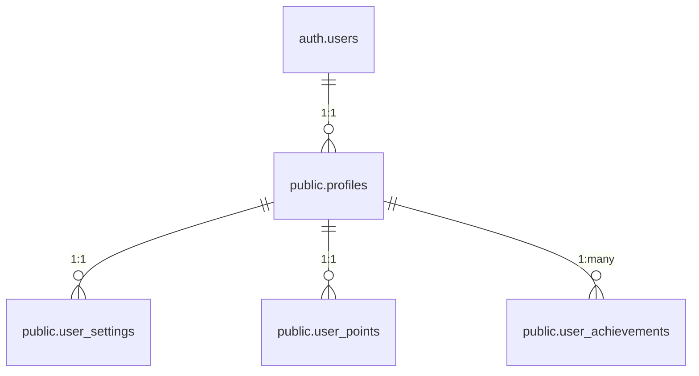

# User Initialization Flow

This document outlines the complete user initialization flow in the application, including database triggers, functions, and the sequence of operations that occur when a new user signs up.

## Overview

When a new user signs up, several related records need to be created across multiple tables. The initialization must respect foreign key constraints and ensure data consistency.

## Database Schema Relationships



## Initialization Sequence

1. **User Creation (Supabase Auth)**
   - User signs up via Supabase Auth
   - A record is created in `auth.users`
   - Supabase Auth triggers the `on_auth_user_created` event

2. **Profile Creation**
   - The `handle_new_user()` function is triggered by the `on_auth_user_created` event
   - Creates a record in `public.profiles`
   - Sets up basic user information (email, etc.)

3. **User Data Initialization**
   - The `initialize_user_data()` function is triggered by the `initialize_user_data_on_profile_insert` trigger
   - Creates a record in `user_points` with default values
   - Creates a record in `user_settings` with default preferences
   - Initializes user achievements in `user_achievements`
   - Creates a welcome notification

## Database Triggers and Functions

### `handle_new_user()`
```sql
CREATE OR REPLACE FUNCTION public.handle_new_user()
RETURNS TRIGGER AS $$
BEGIN
  -- Create the profile record first
  INSERT INTO public.profiles (user_id, email)
  VALUES (NEW.id, NEW.email)
  ON CONFLICT (user_id) DO NOTHING;
  
  RETURN NEW;
END;
$$ LANGUAGE plpgsql SECURITY DEFINER;
```

### `initialize_user_data()`
```sql
CREATE OR REPLACE FUNCTION public.initialize_user_data()
RETURNS TRIGGER AS $$
BEGIN
  -- Initialize user points with all required columns
  INSERT INTO public.user_points (
    user_id, 
    points_earned, 
    aqi_value, 
    location_name
  )
  SELECT 
    NEW.user_id, 
    0 as points_earned, 
    0 as aqi_value, 
    'Initial' as location_name
  WHERE NOT EXISTS (
    SELECT 1 
    FROM public.user_points 
    WHERE user_id = NEW.user_id
  );
  
  -- Initialize user settings (now that profile exists)
  INSERT INTO public.user_settings (user_id)
  SELECT NEW.user_id
  WHERE NOT EXISTS (
    SELECT 1 
    FROM public.user_settings 
    WHERE user_id = NEW.user_id
  );
  
  -- Initialize user achievements
  INSERT INTO public.user_achievements (
    user_id, 
    achievement_id, 
    progress, 
    max_progress, 
    unlocked, 
    unlocked_at, 
    earned_at
  )
  SELECT 
    NEW.user_id, 
    a.id, 
    0 as progress, 
    a.criteria_value as max_progress,
    false as unlocked,
    NULL as unlocked_at,
    NULL as earned_at
  FROM public.achievements a
  WHERE NOT EXISTS (
    SELECT 1 
    FROM public.user_achievements ua 
    WHERE ua.user_id = NEW.user_id AND ua.achievement_id = a.id
  );
  
  -- Create welcome notification
  PERFORM public.create_welcome_notification(NEW.user_id);
  
  RETURN NEW;
END;
$$ LANGUAGE plpgsql SECURITY DEFINER;
```

## Error Handling

The initialization process includes several safeguards:

1. **Idempotency**: All operations are idempotent and can be safely retried
2. **Conflict Handling**: Uses `ON CONFLICT DO NOTHING` to prevent duplicate entries
3. **Transaction Safety**: Each operation is wrapped in a transaction to ensure atomicity
4. **Error Logging**: All errors are logged for debugging purposes

## Testing the Initialization Flow

To test the user initialization flow:

1. Sign up a new user through the application
2. Check the following tables for the new user's records:
   - `auth.users`
   - `public.profiles`
   - `public.user_points`
   - `public.user_settings`
   - `public.user_achievements`
   - `public.notifications`

## Troubleshooting

If you encounter issues with user initialization:

1. Check the Supabase logs for any error messages
2. Verify that all triggers and functions exist and have the correct permissions
3. Ensure that the database schema matches the expected structure
4. Check for any foreign key constraint violations

## Related Files

- `supabase/migrations/20250923083136_fix_signup_initialization_order.sql`
- `supabase/migrations/20250115000011_fix_points_tracking_system.sql`
- `supabase/migrations/20250115000001_create_base_tables.sql`
